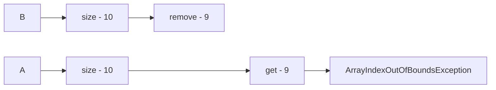

## 基础构建模块

### 5.1 同步容器类

Vector和Hashtable

#### 5.1.1 同步容器类的问题

同步容器类都是线程安全的，但在某些情况下可能需要**额外的客户端加锁来保护复合操作**。复合操作包括：迭代，跳转（当前元素的下一个元素），条件运算（例如：若没有则添加)

```java
public static Object getLast(Vector list) {
	int lastIndex = list.size() - 1;
	return list.get(index);
}

public static void deleteLast(Vector list) {
    int lastIndex = list.size() - 1;
    list.remve(lastIndex);
}
```

Vectore上可能导致混乱结果的复合操作，线程A/B交替调用deleteLast和getLast，可能抛出ArrayIndexOutOfBoundsException

#### 5.1.2 迭代器与ConcurrentModificationException

#### 5.1.3 隐藏迭代器


### 5.2 并发容器



